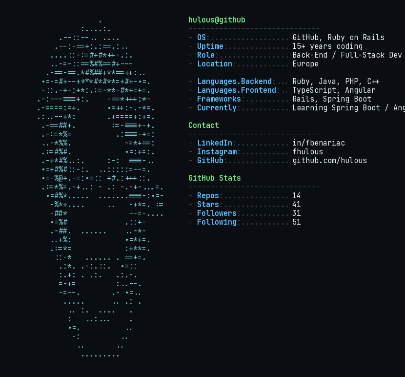

 

---

### 👋 About

Back-end developer with 15+ years building production-grade web apps in **Ruby on Rails**, now expanding into **Java / Spring Boot**, **TypeScript** and **Angular**. I enjoy exploring different languages and paradigms — this profile itself is generated from real ASCII art of my own face 🙂.

### 🛠️ Currently

- Building **ScheduleMe**, a Calendly-style scheduling app in Spring Boot + Thymeleaf
- Running and improving **PhotoMeeter**, a meetup idea for photographer and citywalks
- Completing an *Expert en Développement Logiciel* certification (RNCP41330)
- Exploring Angular Material design systems and MapStruct/DTO patterns

### 📌 Pinned work

| Repo | Description |
|---|---|
| `computing_language_study_notes` | Notes exploring different programming languages and paradigms |
| `mySringBootBase` | JWT REST API starter template (Spring Boot) |
| `fabWorkPHP` | Personal PHP framework (2017) |
| `FabOS` | OS experiments in C++ |

